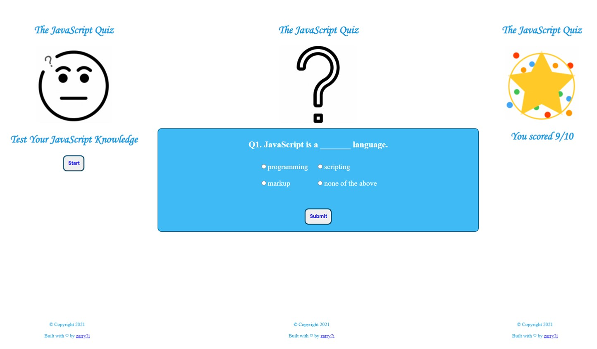
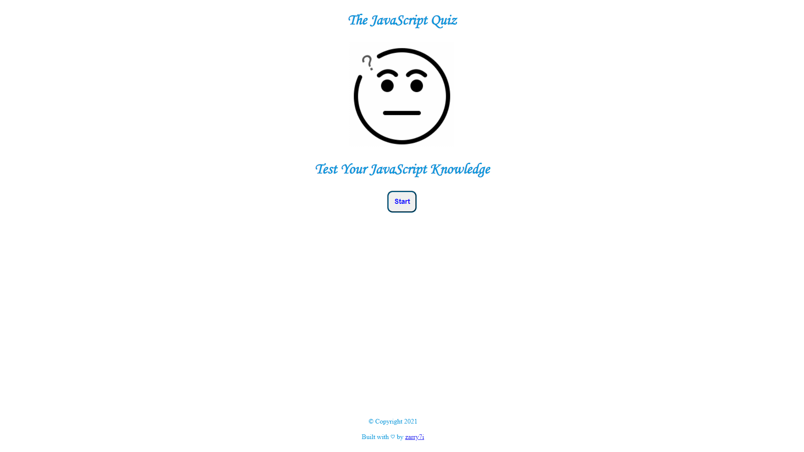
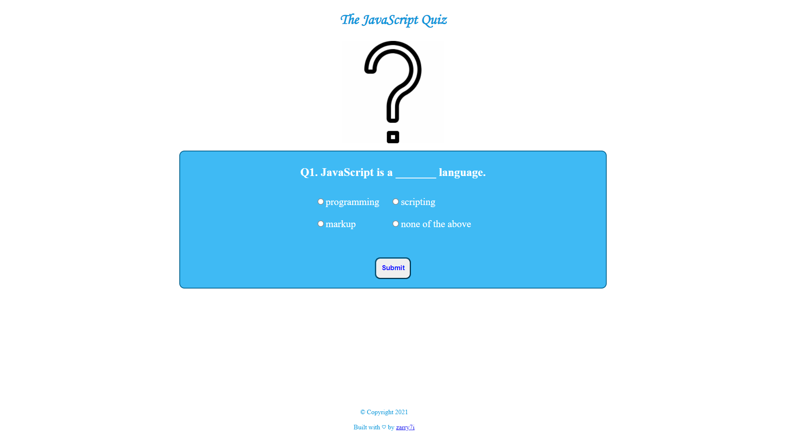
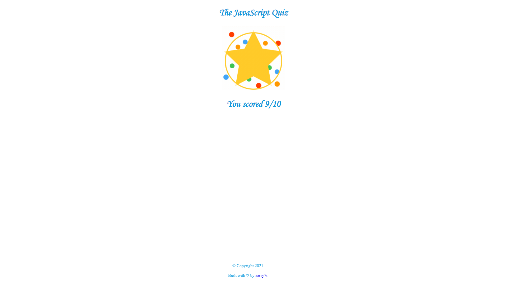

# [The JavaScript Quiz](https://zarry7i.github.io/javascript_quiz/)
> A quiz website to test JS knowledge

## Table of Contents
* [General Info](#general-information)
* [Technologies Used](#technologies-used)
* [Features](#features)
* [Screenshots](#screenshots)
* [Project Status](#project-status)
* [Room for Improvement](#room-for-improvement)
* [Contact](#contact)

## General Information
- Following project provides the Multiple Choice Questions (MCQs) related to JavaScript Framework.
- This quiz test contains 10 questions and there is no time limit.
- User can attempt question in ascending order only. i.e.: he/she can attempt question2 only after submitting the question1.

## Technologies Used
- Languages used:

 

 
 

- Software: Visual Studio Code

## Features
- The entire quiz with all its questions, are written in one HTML file, so we don't need to download different files for every question.
- The complete quiz is created on a single webpage only, therefore it takes less time to run the project.
- In the beginning there will be the quiz icon which after clicking start button will get changed to question mark and question 1 div will appear.
- After clicking on submit button it will show whether the answer is correct or not and submit button will change to next button.
- After clicking on next button and the question 2 div will appear, and so on.
- In the it will show the result of the quiz.

## Screenshots

## Project Status
Project is complete and ready to go.

## Room for Improvement
- This could be a time limited quiz also
- Either we can give different time limits for different questions
- Or we can declare a single time limit for the whole quiz

## Contact
Created by [@zarry7i](https://github.com/zarry7i/) - feel free to contact me!
